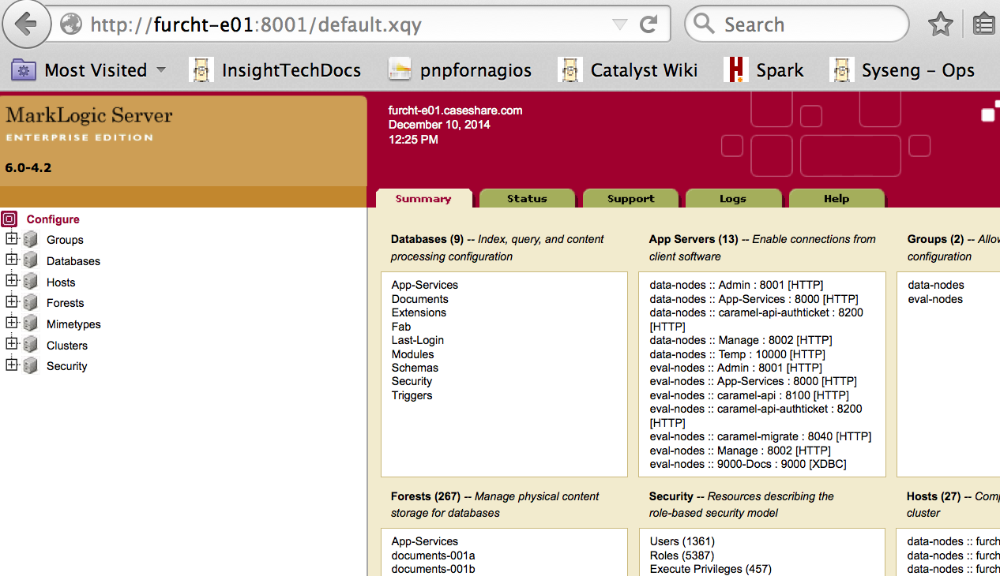

## Getting Started

*  MarkLogic is the back-end database for the Insight application  
  +  MarkLogic (ML) is not part of the CR application  
  +  Users have no direct access to the ML database  
  +  There are many other pieces to the Insight application  
*  ML is a nosql XML database  
  +  Great paper to help understand how it works: [Inside MarkLogic Server](http://developer.marklogic.com/pubs/architecture/inside-marklogic-server-r7.pdf)
  +  Catalyst specific documentation: [Insight Tech Docs](http://dilbert.caseshare.com/mediawiki/index.php/Category:InsightTechDocs)
  +  ML7 Documentation: [Administrator's Guide](http://docs.marklogic.com/guide/admin)

--- .class #id 

## CRS MarchLogic Architecture  

*  Two types of servers ("nodes") in an ML cluster  
  +  e-nodes are load balanced, query/evaluation nodes which accept a query from a user, send out the query to each d-node (which will run the query against the data stored on that d-node), and then consolidate the results from all d-nodes
  +  d-nodes store the data in structures named "forests"
*  A typical cluster (phobos, deimos, furcht, venus, mercury) has about 8 e-nodes and 16 d-nodes
*  Insight Japan will likely start out as a 2 e-node, 4 d-node cluster  
*  Although it currently varies a bit, we are settling into six "master" forests on each d-node  

---

## CRS MarchLogic Architecture (continued)
*  We use what is called "local replication" where we keep a copy of each master forest on another d-node  
  +  For example, d-node 1 has six master ("a") forests which replicate to six replica ("b") forests on d-node 2
  +  d-node 2 will also have six master ("a") forests which replicate to six replica ("b") forests on d-node 1
  +  If d-node 1 goes down (the MarkLogic process stops), the a forests will automatically fail over and the b forests on d-node 2 will become master  
  +  The fail over (when the database is actually unavailable) takes about 1 minute  
  +  If both d-node 1 and d-node 2 go down, the database (i.e., the entire cluster) will be unavailable
*  ML is an ACID database -- ACID (Atomicity, Consistency, Isolation, Durability) is a set of properties that guarantee that database transactions are processed reliably.

---

## A MarkLogic Cluster

*  All the e-nodes and d-nodes in a "cluster" act mostly like a single application on a single server (ML takes care of keeping a consistent code base on each server and manages communications between nodes)
*  Within an ML cluster instance there are a number of "databases"
  +  Documents: user data is stored here and this database is potentially huge (furcht currently stores almost 43 million documents, about 13TB); forests are named documents-001a, documents-001b, etc.  
  +  Security:  data pertaining to users, roles, permissions, etc.; the forest "Security" is stored on the first d-node (e.g., furcht-d01) and its replica, "Security-b" is stored on its replication partner (e.g., furcht-d02)
  +  Modules: application code written in XQuery (known as the Caramel API) is stored on the first d-node; its replica, "Modules-b" is stored on its replication partner
  +  Schemas contains XML schemas; Triggers contains database triggers; and there are a few other small, special purpose databases

---

## The Caramel API

*  MarkLogic has a RESTful API which allows an administrator to access it through curl; however Catalyst started using ML before that RESTful API was added so we (Reed Esau, primarily) wrote our own RESTful API called Caramel
*  Currently about 300 XQuery files stored in the Modules database which each have a unique uri (e.g., "/caramel-api/root/invoke/security/create-role.xqy")
*  Caramel is under active development (Reed Esau and Ignacio Tripodi); they store code in the svn version control system; and periodically new versions must be "deployed" using a deployment script on each cluster
  + to butter and swiss for testing
  + to all production and internal clusters during a Maintenance Window
* Typical curl/caramel call (in this case to get the current caramel version)

```r
curl $(/opt/ml-utils/caramelticket) http://furcht:8200/version
```

--- 

## Bulkops

*  Many operations performed by users in the Insight application involve resource intensive and time consuming operations
*  To balance the use of resources so that users of one case are not affected by operations performed by users in another case, caramel splits large operations into many small pieces which are performed separately; collectively this is known as "bulkops"
*  Within ML, there is a feature known as the Task Server and Task Scheduler
  +  There are currently eight scheduled tasks set to run every minute
  +  Each scheduled task points to an XQuery file in the Modules database (e.g., /caramel-api/root/task/batch-execution.xqy)
  +  Each minute, the Task Server executes that XQuery file on each e-node; typically the XQuery file looks for a particular type of work waiting to be done and, if there is any, performs it

---

## Pausing Bulkops

*  When a cluster is under extreme stress and is largely unresponsive (often because of some hardware failure), the first remedy is normally to pause bulkops to reduce load while troubleshooting
*  There are some key:value pairs ("locks") stored in redis used for this purpose; each time the Task Scheduler runs, it checks the state of these locks; if the "lock" is set it will not execute its XQuery file
*  Set the locks by running the following command ("true" to set the locks and pause bulkops; "false" to clear the locks and resume bulkops; and no parameter just to check the current state of the locks)

```r
CARAMEL_HOST=furcht CLUSTER_PREFIX=furcht set_lock true
```

---

## Logs

*  ML logs can be found in the directory /var/opt/MarkLogic/Logs on each node
*  The primary log file is named "ErrorLog.txt"
  +  At midnight, the logs roll over; a new "ErrorLog.txt" is created for the current day
  +  Older logs are renamed so that ErrorLog_1.txt contains logs for yesterday; ErrorLog_2.txt contains logs for the day before yesterday, etc.
  + the oldest log is ErrorLog_6.txt (older logs are deleted)
*  For e-nodes, ErrorLog.txt is large; the caramel api logs heavily
*  For d-nodes, ErrorLog.txt is smaller and primarily is composed of entries related to merging (other entries may well be an indication of trouble)
*  On the e-nodes, 8200_AccessLog.txt is also useful as it logs access through port 8200 (the primary port we use for caramel and thus virtually everything)
*  Logs are typically forwarded to a logstash/elasticsearch server and can be searched through kibanna

---

## The Admin Console

*  Although ML can be managed through its RESTful API, the easiest way to manage ML is through the Admin console, accessed by a browser at the url: http://furcht-e01:8001/default.xqy  (substitute the name of the cluster e-node)
*  Navigate to Configure > Databases > Documents > Status to check the status of the Documents database
*  Navigate to Configure > Groups > eval-nodes > Task Server > Status to check the status of the Task Server and the bulkops Scheduled Tasks
*  Navigate to Configure > Databases > Security > Users to check roles/permissions for a particular user
*  Navigate to Configure > Databases > Documents > Element Range Indexes to check on a particular index (aka "facet")
*  Navigate to Configure > Hosts > (click on a host) > Status and click on "Shutdown" to stop MarkLogic on a particular node (exercise caution here!)
*  There are many, many paths to explore in the Admin console

---

## The Admin Console




